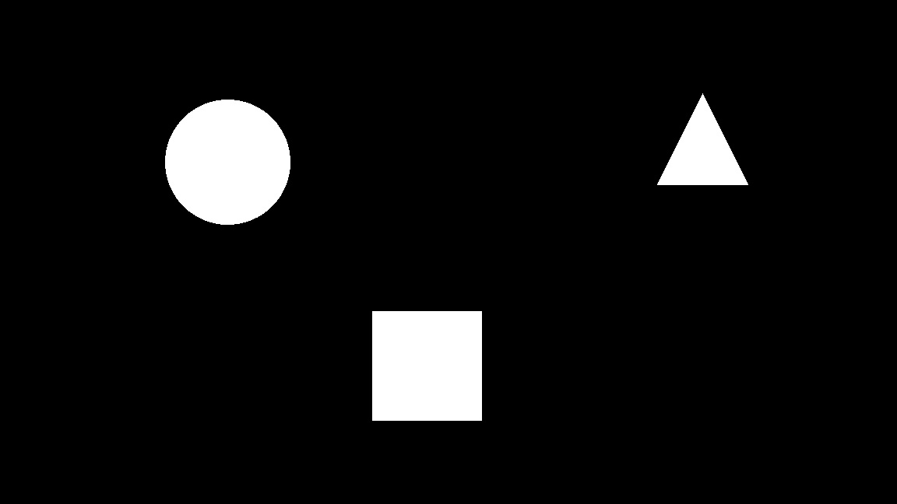
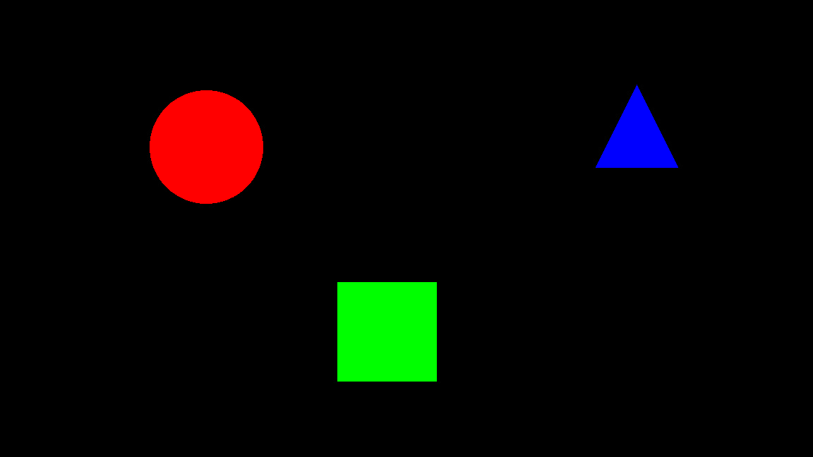

# Figure analytics
Module for counting and filling figures on images.
Now work with only circles, squares and right triangles.

### Requirements
Tested on python 3.8 with requirements from `requirements.txt`.

### Usage
For usage see [notebook](notebooks/usage.ipynb).

### Tests
Run tests `python -m pytest`.

## Before

## After

